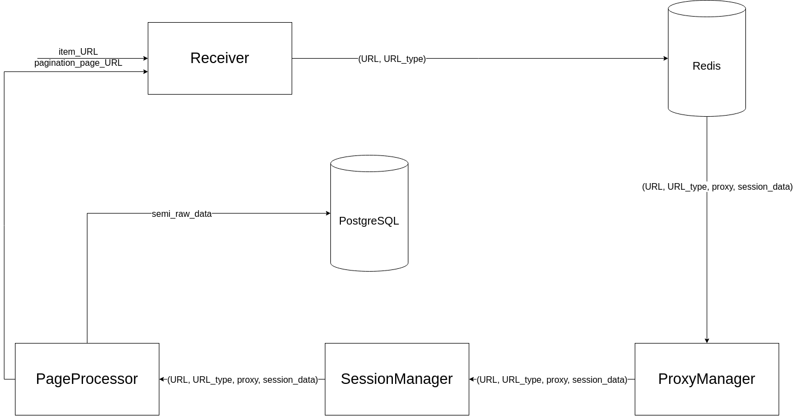

# Real Estate Scraping

The project for gathering actual data from https://www.hongkonghomes.com/en

`psql -h localhost -p 5432 -d real_estate -U admin --password`

# Structure

## Url generator
Service which create task to get urls of each item from special search url.
Create special task for scraper to get item urls, paginate search.

## Receiver
A service to push special type of URL to Redis.

## Redis
Proxy, session, url list storing.

## ProxyManager
Check response on ban and change proxy.

## SessionManager
Update cookies & headers.

## PageProcessor
It reads urls from Redis.

